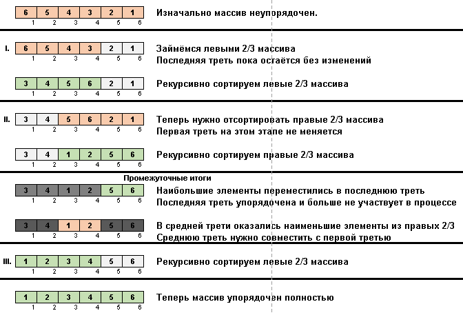

# Выполнил - Попков Георгий Вячеславович 
# Группа - ИУ10-37

# Лабороторная работа - "Алгоритмы сортировки"

## Цель работы

Изучение основных алгоритмов на сортировки.


## Задания на лабораторную работу

| Вариант | n1     | n2     | n3     | n4     | Метод сортировки 1        | Метод сортировки 2        |
|:------- |:-------|:-------|:-------|:-------|:--------------------------|:--------------------------|
|  8      | 1000   | 5000   | 10000  | 100000 | Сортировка чёт-нечет      | Stooge sort               |

## Листинг кода
### Odd-even sort ()
На первом проходе элементы с нечётным ключом сравниваем с соседями,
находящимися на чётных местах (1-й сравниваем со 2-м, затем 3-й с 4-м, 5-й с 6-м и так далее).
Затем наоборот – «чётные по счёту» элементы сравниваем/меняем с «нечётными».
Затем снова «нечёт-чёт», потом опять «чёт-нечет». Процесс останавливается тогда,
когда после подряд двух проходов по массиву («нечётно-чётному» и «чётно-нечётному»)
не произошло ни одного обмена.

```
def odd_even_sort(arr):
    n = len(arr)
    sorted = False
    while not sorted:
        sorted = True
        for i in range(0, n-1, 2):
            if arr[i] > arr[i + 1]:
                arr[i], arr[i + 1] = arr[i + 1], arr[i]
                sorted = False
        for i in range(1, n-1, 2):
            if arr[i] > arr[i + 1]:
                arr[i], arr[i + 1] = arr[i + 1], arr[i]
                sorted = False
```
### Stooge sort ()
1. Сравниваем (и при необходимости меняем) элементы на концах подмассива.
2. Берём две трети подмассива от его начала и к этим 2/3 рекурсивно применяем общий алгоритм.
3. Берём две трети подмассива от его конца и к этим 2/3 рекурсивно применяем общий алгоритм.
4. И опять берём две трети подмассива от его начала и к этим 2/3 рекурсивно применяем общий алгоритм.


```
def stooge_sort(arr, l, h):
    if l >= h:
        return

    if arr[l] > arr[h]:
        arr[l], arr[h] = arr[h], arr[l]

    if h - l + 1 > 2:
        t = (h - l + 1) // 3
        stooge_sort(arr, l, h - t)
        stooge_sort(arr, l + t, h)
        stooge_sort(arr, l, h - t)
```

# Контрольные вопросы и ответы

## 1. В чем состоит суть метода сортировки вставками?
Метод сортировки вставками заключается в последовательном вставлении каждого элемента массива на нужную позицию среди уже отсортированных элементов.

## 2. Какие шаги выполняет алгоритм сортировки вставками?
1. Берется первый элемент массива и считается отсортированным.
2. Последовательно выбирается каждый следующий элемент.
3. Вставляется на нужную позицию в отсортированной части массива.

## 3. Как программно реализуется сортировка вставками?
Пример на Python:
```python
def insertion_sort(arr):
    for i in range(1, len(arr)):
        key = arr[i]
        j = i - 1
        while j >= 0 and key < arr[j]:
            arr[j + 1] = arr[j]
            j -= 1
        arr[j + 1] = key
```
## 4. В чем достоинства и недостатки метода сортировки вставками?
Достоинства:

1. Простота реализации.
2. Эффективен для небольших или почти отсортированных массивов.
Недостатки:

1. Неэффективен для больших массивов, имеет временную сложность O(n²).
## 5. Приведите практический пример сортировки массива методом вставок.
Пример: сортировка массива [5, 2, 9, 1, 5, 6] с помощью метода вставок.

## 6. В чем состоит суть сортировки методом Шелла?
Метод Шелла — это улучшенная версия сортировки вставками, которая использует разбиение массива на подмассивы с элементами на фиксированном шаге.

## 7. За счет чего метод Шелла дает лучшие показатели по сравнению с простейшими методами?
Благодаря сортировке элементов на больших расстояниях друг от друга, метод Шелла снижает количество операций по сравнению с обычной сортировкой вставками.

## 8. Приведите практический пример сортировки массива методом Шелла.
Пример: сортировка массива [8, 5, 3, 6, 7, 2, 1] с использованием промежутков, начинающихся с n/2.

## 9. Какой фактор оказывает наибольшее влияние на эффективность сортировки методом Шелла?
Наибольшее влияние оказывает выбор последовательности шагов разбиения (gap).

## 10. Какие последовательности шагов группировки рекомендуются для практического использования в методе Шелла?
Рекомендуются последовательности Кнута, Циура, Седжвика.

## 11. Как программно реализуется сортировка методом Шелла?
Пример на Python:

```python
def shell_sort(arr):
    gap = len(arr) // 2
    while gap > 0:
        for i in range(gap, len(arr)):
            temp = arr[i]
            j = i
            while j >= gap and arr[j - gap] > temp:
                arr[j] = arr[j - gap]
                j -= gap
            arr[j] = temp
        gap //= 2
```        
## 12. В чем состоит суть метода сортировки выбором?
Метод сортировки выбором заключается в поиске минимального элемента в неотсортированной части массива и его обмене с первым элементом этой части.

## 13. Какие шаги выполняет алгоритм сортировки выбором?
Находим минимальный элемент в неотсортированной части массива.
Меняем его местами с первым элементом неотсортированной части.
Повторяем процесс для оставшейся части массива.
## 14. Как программно реализуется сортировка выбором?
Пример на Python:

```python
def selection_sort(arr):
    for i in range(len(arr)):
        min_idx = i
        for j in range(i + 1, len(arr)):
            if arr[j] < arr[min_idx]:
                min_idx = j
        arr[i], arr[min_idx] = arr[min_idx], arr[i]
```
## 15. В чем достоинства и недостатки метода сортировки выбором?
Достоинства:

1. Простота реализации.
2. Минимальное количество пересылок.
Недостатки:

1. Плохая производительность на больших массивах (O(n²)).
## 16. Приведите практический пример сортировки массива методом выбора.
Пример: сортировка массива [29, 10, 14, 37, 14] методом выбора.

## 17. В чем состоит суть метода сортировки обменом?
Сортировка обменом (пузырьковая сортировка) заключается в попарном сравнении элементов и обмене их местами, если они расположены в неправильном порядке.

## 18. Какие шаги выполняет алгоритм сортировки обменом?
Проходим по массиву, сравнивая соседние элементы.
Меняем их местами, если они расположены неправильно.
Повторяем шаги, пока массив не будет отсортирован.
## 19. Как программно реализуется сортировка обменом?
Пример на Python:

```python
def bubble_sort(arr):
    n = len(arr)
    for i in range(n):
        for j in range(0, n - i - 1):
            if arr[j] > arr[j + 1]:
                arr[j], arr[j + 1] = arr[j + 1], arr[j]
```
## 20. В чем достоинства и недостатки метода сортировки обменом?
Достоинства:

1. Простота реализации.
Недостатки:

1. Низкая производительность на больших массивах (O(n²)).
## 21. Приведите практический пример сортировки массива методом обмена.
Пример: сортировка массива [5, 1, 4, 2, 8] методом обмена.

## 22. В чем состоит суть метода быстрой сортировки?
Метод быстрой сортировки (Quicksort) основан на выборе опорного элемента, относительно которого массив делится на две части: меньшие и большие элементы.

## 23. За счет чего метод быстрой сортировки дает лучшие показатели по сравнению с простейшими методами?
Метод быстрой сортировки использует эффективное разделение массива на части, что позволяет сократить количество операций.

## 24. Что такое опорный элемент в методе быстрой сортировки и как он используется?
Опорный элемент — это элемент, относительно которого выполняется разделение массива на меньшие и большие части.

## 25. Приведите практический пример быстрой сортировки массива.
Пример: сортировка массива [3, 6, 8, 10, 1, 2, 1] методом быстрой сортировки.

## 26. Что можно сказать о применимости метода быстрой сортировки с точки зрения его эффективности?
Быстрая сортировка эффективна для большинства наборов данных и имеет временную сложность O(n log n).

## 27. Как программно реализуется рекурсивный вариант метода быстрой сортировки?
Пример на Python:
````
python
def quicksort(arr):
    if len(arr) <= 1:
        return arr
    else:
        pivot = arr[len(arr) // 2]
        left = [x for x in arr if x < pivot]
        middle = [x for x in arr if x == pivot]
        right = [x for x in arr if x > pivot]
        return quicksort(left) + middle + quicksort(right)
````
## 28. В чем состоит суть метода пирамидальной сортировки?
Пирамидальная сортировка (Heapsort) основана на построении двоичной пирамиды (кучи), после чего элементы последовательно извлекаются из пирамиды в отсортированном порядке.

## 29. Как программно реализуется пирамидальная сортировка?
Пример на Python:

```python
def heapify(arr, n, i):
    largest = i
    left = 2 * i + 1
    right = 2 * i + 2

    if left < n and arr[i] < arr[left]:
        largest = left
    if right < n and arr[largest] < arr[right]:
        largest = right
    if largest != i:
        arr[i], arr[largest] = arr[largest], arr[i]
        heapify(arr, n, largest)

def heapsort(arr):
    n = len(arr)
    for i in range(n // 2 - 1, -1, -1):
        heapify(arr, n, i)
    for i in range(n - 1, 0, -1):
        arr[i], arr[0] = arr[0], arr[i]
        heapify(arr, i, 0)
```
## 30. В чем состоит суть метода пирамидальной сортировки?
Пирамидальная сортировка основана на преобразовании массива в структуру данных кучи и постепенном извлечении максимальных элементов.

## 31. Какой набор данных имеет пирамидальную организацию?
Куча — это двоичное дерево, где каждый узел больше (в случае max-heap) или меньше (в случае min-heap) всех своих потомков.

## 32. Чем отличаются друг от друга дерево поиска и пирамидальное дерево?
Дерево поиска (binary search tree) — это структура данных, где каждый узел имеет не более двух дочерних узлов, причем левое поддерево содержит только узлы с меньшими значениями, а правое — только с большими. Пирамидальное дерево (heap) организовано так, что каждый узел больше (или меньше) своих дочерних узлов, но не имеет строгой структуры, как в дереве поиска.

## 33. Приведите пример пирамидального дерева с целочисленными ключами.
Пример пирамидального дерева (max-heap):
```
       10
      /  \
     9    8
    / \  / \
   7  6 5   4
```
## 34. Какие полезные свойства имеет пирамидальное дерево?
Пирамидальное дерево обеспечивает быстрый доступ к максимальному (или минимальному) элементу, а также позволяет эффективно добавлять и удалять элементы с поддержанием свойств кучи.

## 35. Какие шаги выполняются при построении пирамидального дерева?
Инициализация массива.
Преобразование массива в двоичную кучу с помощью метода "просеивания" (heapify).
Построение пирамидального дерева снизу вверх.
## 36. Что такое просеивание элемента через пирамиду?
Просеивание — это процесс перемещения элемента в пирамидальном дереве, чтобы восстановить свойства кучи, когда элемент был перемещен или изменен.

## 38. Какие шаги выполняются на втором этапе пирамидальной сортировки?
Извлечение максимального элемента (корня кучи) и размещение его в конце массива.
Уменьшение размера кучи и восстановление свойств кучи через просеивание.
## 39. Приведите практический пример реализации второго этапа пирамидальной сортировки.
Для массива [10, 9, 8, 7] после извлечения 10, оставшаяся куча будет:

       9
      / \
     7   8
В результате, массив будет [10, 9, 8, 7].

## 40. Что можно сказать о трудоемкости метода пирамидальной сортировки?
Трудоемкость пирамидальной сортировки составляет O(n log n) в среднем и в худшем случаях, что делает ее эффективной для сортировки больших массивов.
